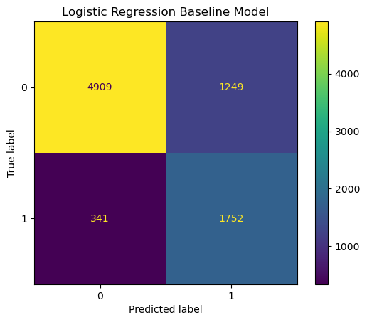
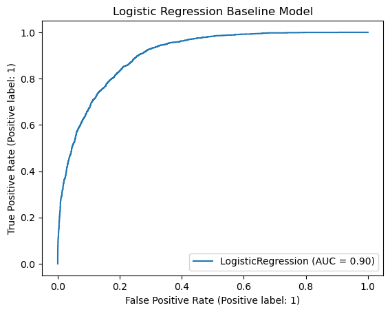
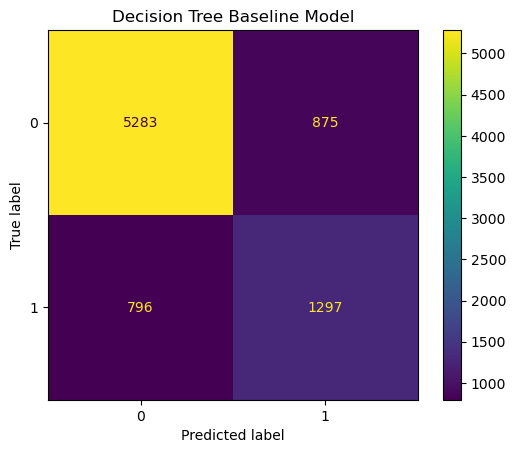
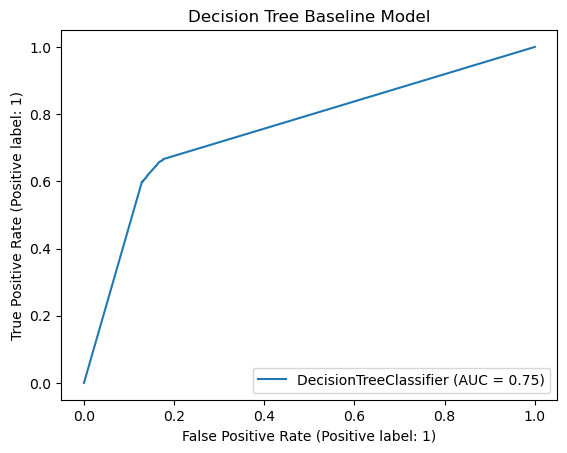
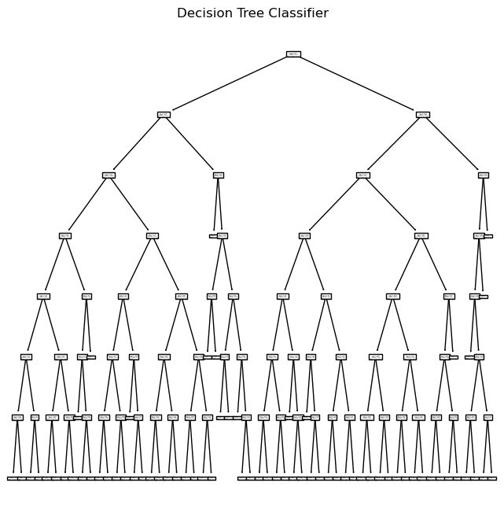
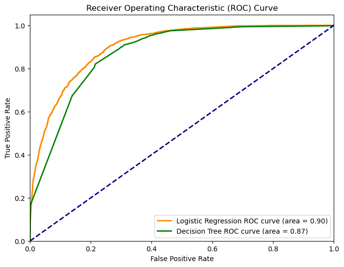

# Salary Data Classification

**Authors**: Franko Ndou

## Overview

The HR department plays a crucial role in identifying the right candidates for job positions. However, the process of determining a candidate's suitability can be time-consuming and subject to biases. To streamline their decision-making process and make it more data-driven, the HR department aims to develop a Machine Learning (ML) classification model. This model will predict whether a candidate is likely to earn more than $50,000 annually, helping the HR team make informed decisions about candidate qualifications.


## Business Problem

Microsoft is tasking me with demonstrating my data science expertise by assisting their HR department in developing a classification model. This model will predict whether job applicants are likely to earn more or less than $50,000 annually, helping Microsoft optimize its hiring process for a specific $50,000 annual salary position. By successfully developing this data-driven solution, I will not only contribute to improving their HR practices but also showcase my capabilities as a data scientist. Microsoft's commitment to innovation and efficiency in talent acquisition aligns with this project's goal.


## Data

I'm using salary cenus data that was donated on 4/30/1996 to the UCI Machine Learning Repository which can be found [here](https://archive.ics.uci.edu/dataset/20/census+income).

## Methods

Through upscaling a unbalanced dataset using SMOTE, using classes to test multiple hyperparameters, I was able to find the optimal Logistic Regression and Decision Tree model for my dataset.

## Baseline Models

Assembling a top-notch production team is essential for creating a successful film. Identifying the best director and writer for the job is crucial. While actors play significant roles, directors often craft roles with specific actors in mind. Therefore, determining the most successful actor may not directly contribute to our production team's ability to make the best possible movie. The success of a film largely hinges on the artistic vision of the director and the script quality. Relying solely on statistics related to actors may not enhance our return on investment (ROI) and could potentially have a detrimental impact on the film's quality.

### Logistic Regression

Baseline Matrix:
<br>

<br>
Baseline AUC:
<br>

<br>
Scores:
```
Accuracy train Data: 82.82%
Accuracy test Data: 80.73%

Recall train Data: 85.93%
Recall test Data: 83.71%

Precision train Data: 80.9%
Precision test Data: 58.38%

F1 train Data: 83.34%
F1 test Data: 68.79%
```
The accuracy and AUC is already pretty good so it may be difficult to improve this model from its baseline. But the performance is defintiely looking good.

### Decision Tree

Baseline Decision Tree:
<br>


Baseline DT Matrix:
<br>


Baseline AUC:
<br>


Scores:
```
Accuracy train Data: 98.38%
Accuracy test Data: 79.75%

Recall train Data: 97.69%
Recall test Data: 61.97%

Precision train Data: 99.05%
Precision test Data: 59.71%

F1 train Data: 98.37%
F1 test Data: 60.82%
```
This model is definitely overfitted which is to be expected with DT models. Its not performing as well as the LogReg either but we should base our decision on the tuned models. The AUC is fairly low compared to the LogReg as well.


## Trained Models

After all hyperparameter tuning these are the final models I created.

### Logistic Regression

Best Hyper-Parameters for Logistic Regressions:
```
[({'C': 1.0,
   'max_iter': 1000,
   'penalty': 'l1',
   'random_state': 42,
   'solver': 'liblinear',
   'tol': 0.001},
  0.8271080139372822,
  0.8074172827536056)]
```
Scores for this model:
```
Accuracy train: 0.828
Accuracy test: 0.807

Recall train: 0.859
Recall test: 0.839

F1 train: 0.833
F1 test:  0.689

CV results: 0.827

Precision train: 0.809
Precision test: 0.584
```
### Decision Tree

Best Hyper-Parameters for Decision Tree:
```
[({'criterion': 'gini',
   'max_depth': 7,
   'min_samples_leaf': 2,
   'min_samples_split': 2,
   'random_state': 42},
  0.8286759581881533,
  0.7765119379469155)]
```
Scores for this model:
```
Accuracy train: 0.833
Accuracy test: 0.777

Recall train: 0.910
Recall test: 0.852

F1 train: 0.845
F1 test: 0.659

CV results: 0.829

Precision train: 0.809
Precision test: 0.584
```
Trained DT Model:
<br>



ROC for both models:
<br>



## Conclusion

In this project, I aimed to develop classification models to predict whether a candidate's income exceeds $50,000 annually. Working with an imbalanced dataset, I employed various techniques to enhance model performance. Here's a summary of my findings:

### Logistic Regression
The logistic regression model provided a reasonable baseline performance with an accuracy of approximately 80.73% on the test data. However, precision on the test set was lower at 58.38%, indicating that there were some false positives. This model can be considered a suitable starting point, but there's room for improvement.

### Decision Tree
The decision tree model, while overfitting the training data, showed promise. Its test accuracy was around 79.75%, with precision at 59.71%. Although overfitting is a concern, the model's potential for generalization suggests that further optimization and tuning may yield superior results.

### Recommendations
  - Prefer Logistic Regression: Among the two models, the logistic regression model outperforms the decision tree model, showing better accuracy and precision. It is advisable to prioritize using the logistic regression model for predictions.

  - Further Model Improvement: While we have made progress in optimizing these models, it's worth exploring other classification algorithms like K-Nearest Neighbors (KNN) or Random Forest to potentially achieve better performance. These models may offer different insights and capabilities for your specific use case.


### Next Steps
To continue improving and expanding this project, here are some suggested next steps:

  - Cloud Deployment: I would consider deploying the machine learning model to a cloud service, such as AWS or Saturn Cloud. This will enable me to conduct more extensive hyperparameter tuning and make the model accessible for real-world predictions.

  - Explore Additional Models: I'd experiment with different classification models, such as K-Nearest Neighbors (KNN), Random Forest, Support Vector Machines (SVM), or Neural Networks. Each model has its strengths and may provide enhanced predictive capabilities.

  - Polish Model Pipelines: Streamlining the model training and testing processes by refining the ModelValidator class and pipelines would be essential. Creating efficient and versatile pipelines can help save time and maintain consistency in the modeling workflow.

  - Data Enhancement: Importing more up-to-date and detailed data to enhance the quality of predictions would be a priority. Cleaning and maintaining a rich dataset is crucial for accurate modeling.

  - Comparative Analysis: Comparing the performance of different models across various genres, directors, or other relevant factors can offer valuable insights into the preferences and trends in the industry.

  - By following these next steps and continuously refining the models, I can provide more accurate and insightful predictions, making a valuable contribution to Microsoft's HR practices and further showcasing my data science capabilities.

## For More Information

Please review the full analysis in [my Jupyter Notebook](./code/Salary-Classifcation-Models.ipynb) or my [presentation](./Salary_Prediction.pdf).

For any additional questions, please contact me:

**Franko Ndou & frankondou@gmail.com**

## Repository Structure

Describe the structure of your repository and its contents, for example:

```
├── code
│   ├── __init__.py
│   ├── Cleaning-Salary-Data.ipynb
│   └── Salary-Classifcation-Models.ipynb
├── images
├── README.md
├── .gitignore
└── Salary_Prediction.pdf
```
